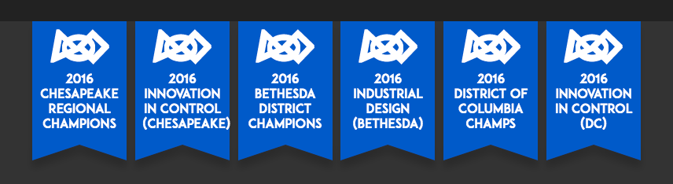

# banners.css

> Simple CSS library for simlated [FRC](http://firstinspires.org/robotics/frc) blue banners (typically presented to teams upon receiving a competition award).

[As seen on The Blue Alliance!](https://www.thebluealliance.com/team/254/history)

## Instructions
This framework allows for three different types of banner markup:

### Row
To define a group of banners:
1. Create a `<ul>` with the class of `banners`. Each `<li>` in the list will be turned into a banner.
2. OPTIONAL: Insert an `` at the starting of each `<li>` with the `src` pointing to the `first.svg` file  included in this repository. This will put a FIRST logo on the banner. This can be done for all three methods of declaring a banner.
3. Fill the rest of each `<li>` with the name of the award. Well, technically, you can put any content you want in it. But the name of the award is probably best.

### Individual banner
Repeat the above process, except instead of defining a `<ul>` with `<li>`s as children, define one `
` with the class of `banner`. Treat this like you would a `<li>` in the process above.

### Page-wide
Repeat the first process exactly, however with one extra step: enclose the `<ul>` with a `
` with the class `banner-parent`. This will cause the row of banners to expand to fill the whole width of the screen, and any extra banners will be visible by scrolling to the side.

## Examples
* See `example.html`
* [Team](http://www.thebluealliance.com/team/1418/2016) and [Team History](http://www.thebluealliance.com/team/254/history) pages on The Blue Alliance
* [Team 1418's website](http://1418.team)
* [Team 1257's awards page](http://team1257.org/#awards)
* [Team 3492's about page](http://parts3492.org/about/)

If you use this framework on your own project, feel free to open a pull request to add it to this list!

## Author
Created by [Erik Boesen](https://github.com/ErikBoesen). To ensure future maintenance, control is vested in [Team 1418](https://github.com/frc1418), for whose [website](http://1418.team) the library was originally developed.

## License
This software is protected under the [MIT License](LICENSE).
